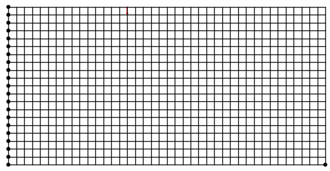

## Rule-based Distribute Topology Optimization 

Topology optimization has become an important method to improve the quality of fabrication in 3D printing. However, it is difficult to build mathematical models for different design cases. This paper presents a rule-based structure optimization framework for designing topology structures. Local partitions of the design space are bind with an intelligent agent, which makes it possible to convert the topology optimization into a rule-based distribute optimization problem. The design capability of the framework is demonstrated through two examples of shell structure design. Simple defeasible rules are used to build up the behaviors of the agents. The target model is generated by the emergence of a large number of agents. The rules can be transferred and the framework can be extended to solve different optimization problems with multiple constraints.


### Usage:
* Problem visualization
```
python visprob.py
```


* Evolution
```
python runto.py --optimizer [oc | mas]
```
| |OC|2 rules MAS|
|---:|:-------:|:------------------------: |
|Congestion|||
|Structure|||


### Code
* Load
Load class can init load case. 
### Rule template
Coming soon...

### Misc
The [original SIMP code](https://github.com/1iyiwei/topopt) is provided by Li-Yi Wei (魏立一) from Hongkong University.
